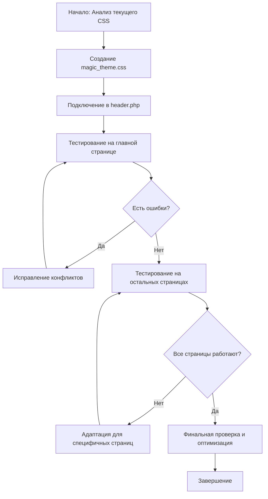

# План разработки магического стиля оформления

## Цель
Создать отдельный файл `magic_theme.css` для создания магической темы веб-приложения "Волшебная ЛАВКА", применимо ко всем страницам сайта.

## Текущее состояние
- Существующий CSS: `css/style.css` (638 строк) уже содержит магическую тему с:
  - Цветовой палитрой: фиолетовый (#4B0082), синий (#191970), золотой (#FFD700)
  - Анимациями: glow, float, shimmer
  - Эффектами: свечение, тени, градиенты
- Подключение: через `includes/header.php` (строка 16)
- Изображение для вдохновения: `images/main8х1.png` (предположительно магическое/волшебное)

## Задачи

### 1. Создание файла `magic_theme.css`
**Расположение:** `css/magic_theme.css`

**Содержание:**
- Дополнительные CSS-переменные для расширенной цветовой палитры
- Новые анимации (частицы, мерцание, волны)
- Улучшенные эффекты для существующих элементов
- Специальные стили для магических элементов

**Примерная структура:**
```css
/* magic_theme.css - Расширение магической темы */

:root {
    /* Дополнительные цвета */
    --magic-purple: #2A0A4A;
    --magic-blue: #0F1A3D;
    --magic-lavender: #9D7BFF;
    --magic-emerald: #00CC88;
    --magic-ruby: #CC0066;
    --magic-gold: #FFD700;
    --magic-silver: #C0C0C0;
    
    /* Эффекты */
    --particle-glow: 0 0 15px rgba(157, 123, 255, 0.7);
    --sparkle-animation: sparkle 2s infinite;
}

/* Анимация частиц */
@keyframes sparkle {
    0%, 100% { opacity: 0.3; transform: scale(1); }
    50% { opacity: 1; transform: scale(1.2); }
}

/* Эффект магического свечения для заголовков */
.magic-glow {
    text-shadow: 0 0 10px var(--magic-lavender),
                 0 0 20px var(--magic-lavender),
                 0 0 30px var(--magic-purple);
    animation: pulse 2s ease-in-out infinite alternate;
}

/* Стили для кнопок с магическим эффектом */
.btn-magic {
    background: linear-gradient(45deg, var(--magic-purple), var(--magic-blue));
    border: 1px solid var(--magic-gold);
    box-shadow: var(--particle-glow);
    transition: all 0.3s ease;
}

.btn-magic:hover {
    transform: translateY(-3px);
    box-shadow: 0 0 25px rgba(255, 215, 0, 0.8);
}

/* Фоновые элементы (частицы) */
.particle {
    position: absolute;
    background: rgba(157, 123, 255, 0.3);
    border-radius: 50%;
    pointer-events: none;
    animation: float 6s ease-in-out infinite;
}
```

### 2. Интеграция во все страницы сайта
**Изменения в `includes/header.php`:**
```html
<!-- Существующая строка 16 -->
<link rel="stylesheet" href="/css/style.css">
<!-- Заменить на -->
<link rel="stylesheet" href="/css/magic_theme.css">
```

**Проверка всех страниц, которые могут иметь собственные заголовки:**
- `admin/` - административные страницы
- `moderator/` - страницы модератора
- `users/` - пользовательские страницы
- `basket/` - страницы корзины

**Стратегия:** Убедиться, что все страницы используют `header.php` (большинство используют). Если есть страницы с собственным заголовком, добавить подключение `magic_theme.css`.

### 3. Проверка совместимости
**Тестирование на ключевых страницах:**
1. Главная страница (`index.php`)
2. Каталог товаров (`shop.php`)
3. Корзина (`basket/basket.php`)
4. Личный кабинет (`users/profile.php`)
5. Админ-панель (`admin/index.php`)
6. Страница оформления заказа (`checkout.php`)

**Критерии проверки:**
- Цветовая схема соответствует магической теме
- Анимации работают плавно
- Эффекты не нарушают юзабилити
- Отсутствие конфликтов с существующими стилями
- Адаптивность на разных устройствах

### 4. Дополнительные магические элементы
**Предлагаемые элементы для реализации:**

| Элемент | Описание | Приоритет |
|---------|----------|-----------|
| Анимация частиц на фоне | Медленно движущиеся точки, создающие атмосферу магии | Высокий |
| Свечение активных элементов | Подсветка активных ссылок, кнопок, полей ввода | Высокий |
| Магические переходы | Плавные переходы между страницами (если используется SPA-подход) | Средний |
| Стилизованные скроллбары | Продолжение существующего стиля скроллбара | Низкий |
| Эффекты при наведении на товары | Увеличение, свечение, появление описания | Высокий |
| Анимация логотипа | Мерцание или плавное вращение | Средний |

### 5. Временная шкала (без оценок времени)
1. Создание файла `magic_theme.css` с базовыми расширениями
2. Добавление подключения в `header.php`
3. Тестирование на основных страницах
4. Итеративная доработка на основе обратной связи
5. Финальная проверка на всех страницах

### 6. Риски и митигации
| Риск | Вероятность | Влияние | Меры снижения |
|------|-------------|---------|---------------|
| Конфликт стилей с существующим CSS | Средняя | Высокое | Использовать специфичные селекторы, тестировать поэтапно |
| Падение производительности из-за анимаций | Низкая | Среднее | Оптимизировать анимации, использовать `will-change` |
| Несовместимость со старыми браузерами | Низкая | Низкое | Использовать graceful degradation |
| Увеличение времени загрузки | Низкая | Низкое | Минификация CSS, кэширование |

## Диаграмма workflow


## Следующие шаги
1. Переключиться в режим **Code** для создания и редактирования CSS файлов
2. Создать файл `css/magic_theme.css` с предложенным содержимым
3. Обновить `includes/header.php` для подключения нового файла
4. Проверить отображение на нескольких страницах
5. При необходимости внести корректировки

## Примечания
- Новый CSS файл должен дополнять, а не заменять существующий `style.css`
- Рекомендуется использовать CSS-переменные для обеспечения согласованности
- Все анимации должны иметь опцию `prefers-reduced-motion` для доступности
- Тестировать на реальных устройствах для проверки производительности